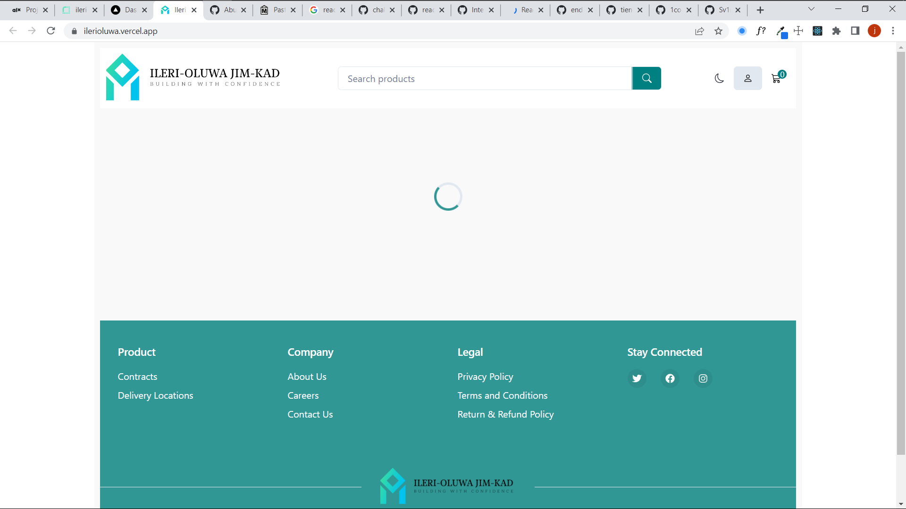
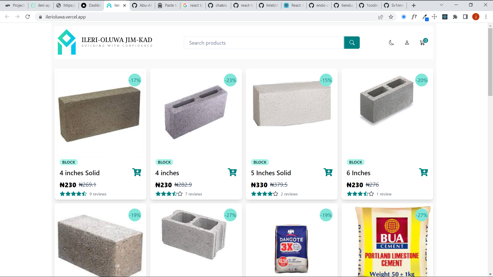
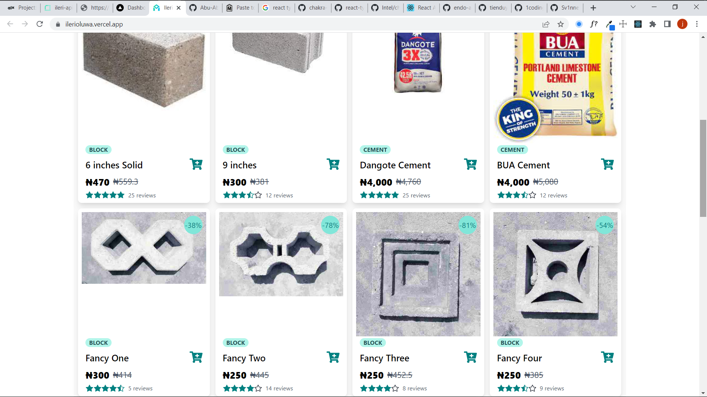
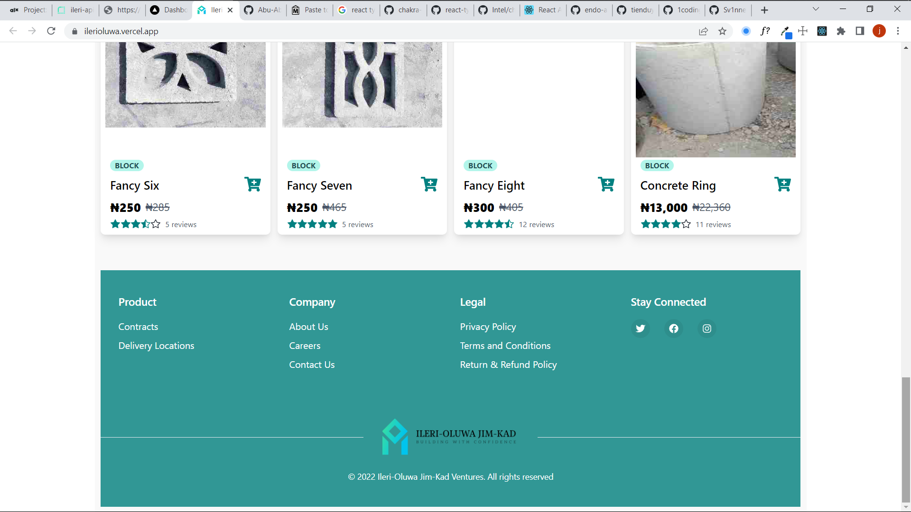
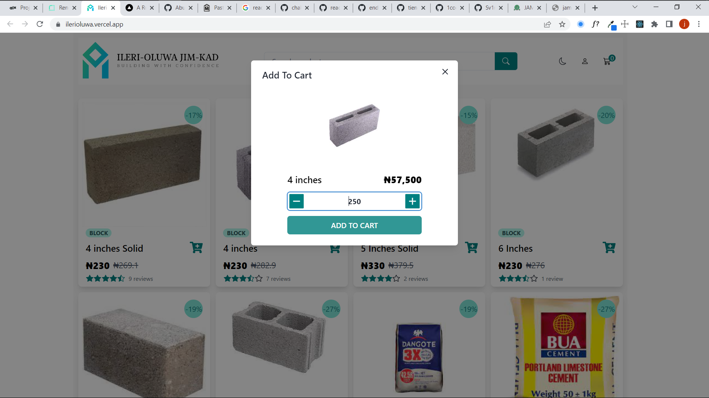
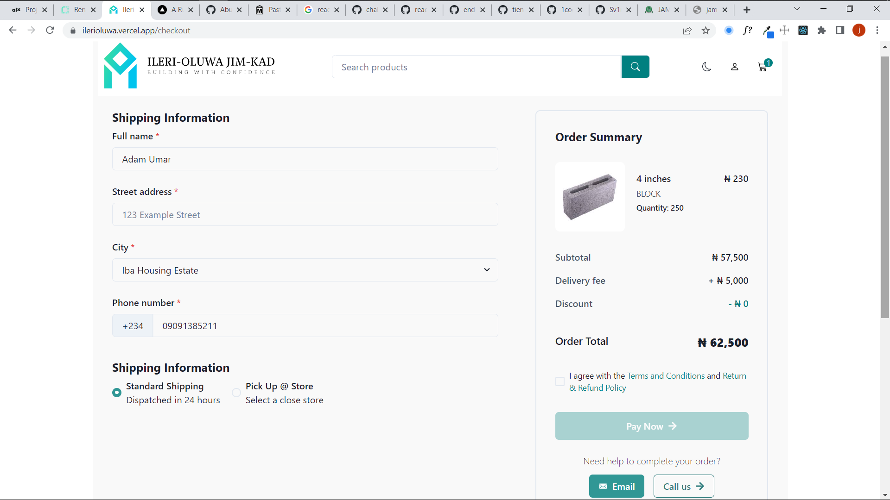

ILERI OLUWA ECOMMERCE
===============

This project was developed for a block industry Ecommerce website. You can find its coresponding Backend project [Here](https://github.com/Abu-Abdillah1/ileri-backend)

Overview
----------------------------
This is a responsive and fully functional ecommerce that enables users to play orders and debit their cards

Screenshots
----------------------------

Technologies used
----------------------------

-   react.js (create-react-app)
-   TypeScript

### Styling:

-   Chakra UI
-   CSS

### Routing:

-   react-router

### Payment processing:

-   PayStack API
### Others
-   Formik
-   React-query

### Hosting and server side functions

-   Vercel
-   Render

Links to source code and live site:
-----------------------------------------------------------------------------------------------------------------------------

-   [Live site hosted on Vercel](https://ilerioluwa.vercel.app/)
-   [Source code on Github](https://github.com/Abu-Abdillah1/ileri-frontend.git)
-   [Backend API source code](https://github.com/Abu-Abdillah1/ileri-frontend.git)

Contribution
----------------------------------------------------------------------------

Anyone interested in the project can contribute to this repository. To do this, first fork the repository. Then make the changes in your repository. Finally, send a pull request to this repository.

## Author
Abu Abdillah olamide14044@gmail.com - [Twitter](https://twitter.com/abu4code) - [LinkedIn](linkedin.com/in/abdul-quadri-jimoh-69369714a)

Copyright (c) 2022 Abu Abdillah https://github.com/Abu-Abdillah1/

